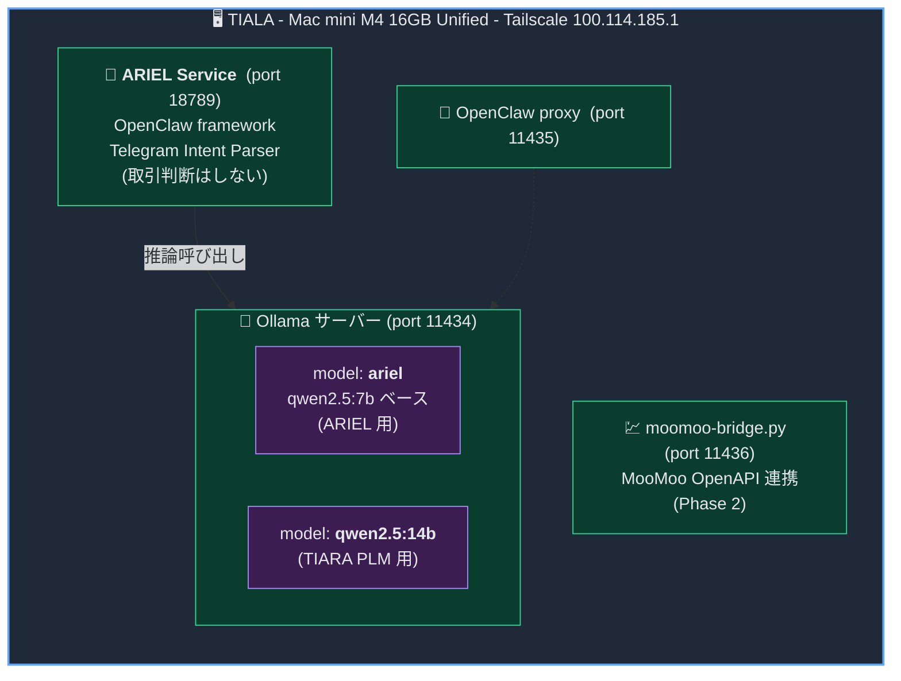
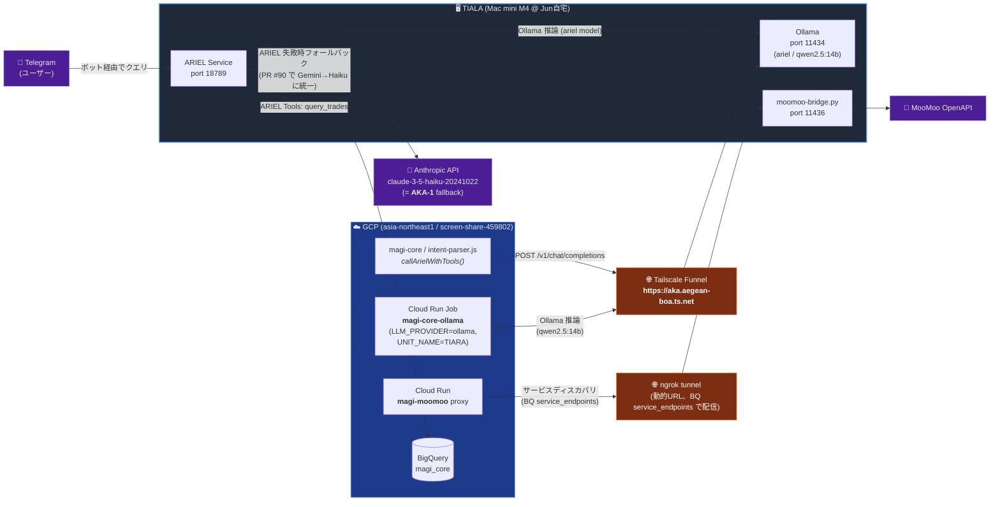
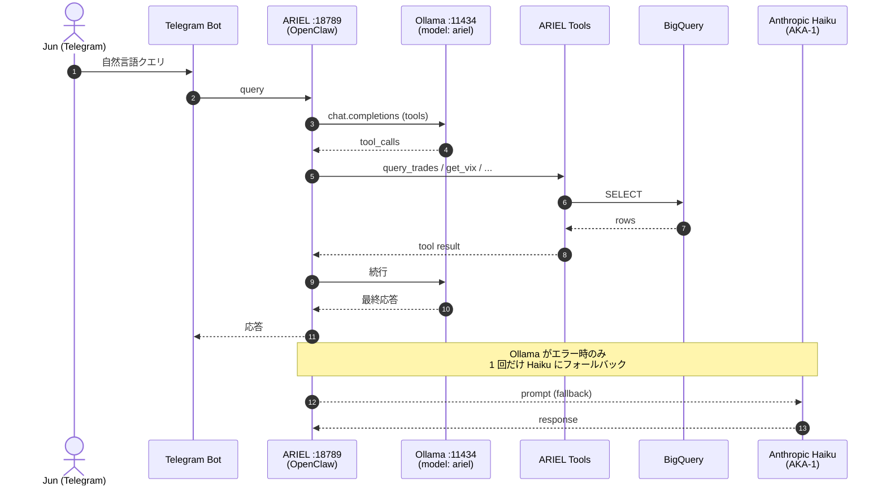
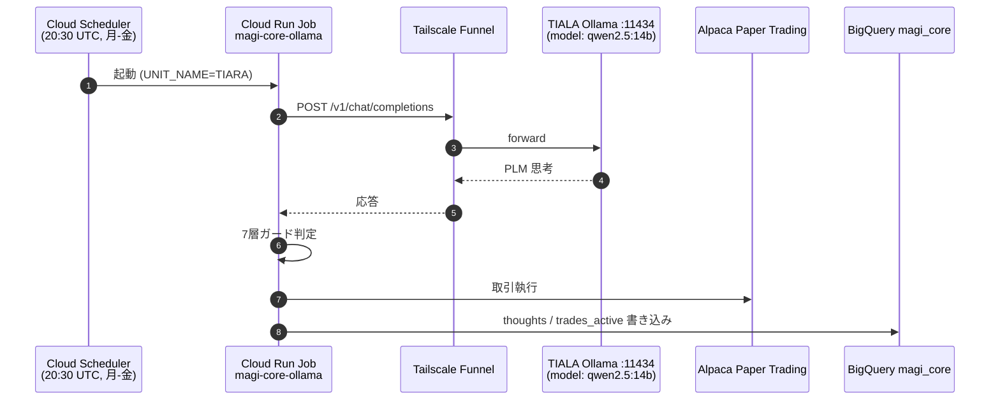
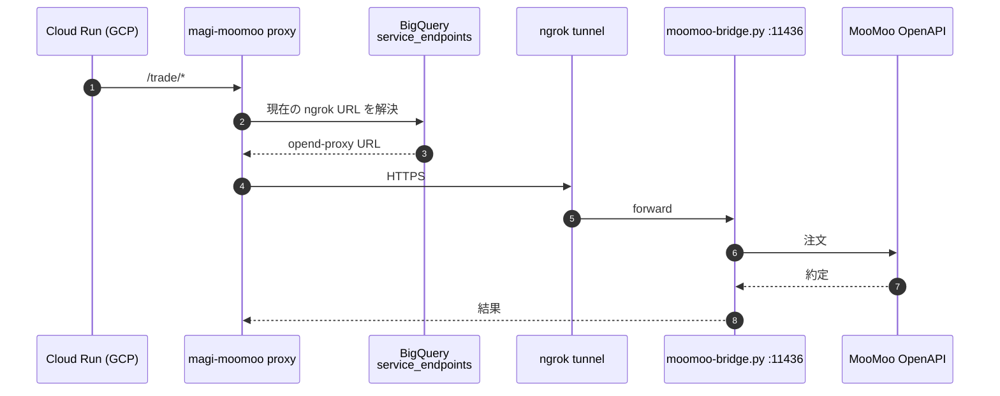

# TIALA 構成図

最終更新: 2026-05-11

> **TIALA = ハードウェア名（末尾 LA）/ TIARA = PLM ユニット名（末尾 RA）**。L/R 1 文字違いのため混同厳禁。

## 概要

TIALA は **Jun 自宅に設置された Mac mini M4 16GB Unified** で、Tailscale IP `100.114.185.1` を持つ。
このホスト上で **4 つのサービス + 1 つのカスタム Ollama モデル群** が常駐し、`Tailscale Funnel`（`https://aka.aegean-boa.ts.net`）と `ngrok` で外部の GCP / Telegram / MooMoo に接続する。

---

## 1. TIALA 内部構成（マシン内）

### サービス一覧

| ポート | サービス | 役割 | 備考 |
|---|---|---|---|
| **11434** | Ollama HTTP API | ローカル LLM 推論サーバー | `ariel` / `qwen2.5:14b` の 2 モデル提供 |
| **11435** | OpenClaw proxy | OpenClaw フレームワークのプロキシ層 | 内部接続用 |
| **11436** | moomoo-bridge.py | MooMoo OpenAPI へのブリッジ | Phase 2 取引用 |
| **18789** | ARIEL Service | Telegram Intent Parser（OpenClaw） | 取引判断は行わない |

### Ollama 上のモデル

| モデル名（Ollama） | ベース | 用途 |
|---|---|---|
| `ariel` | qwen2.5:7b ベースのカスタム Modelfile | ARIEL 用（Intent Parser のツール呼び出し） |
| `qwen2.5:14b` | 公式 qwen2.5:14b | TIARA PLM（自律取引ユニット） |

---

## 2. TIALA と外部の接続関係

### 外部接続まとめ

| 接続経路 | 用途 | エンドポイント |
|---|---|---|
| Tailscale Funnel | TIALA Ollama を GCP / 外部から HTTPS で叩く | `https://aka.aegean-boa.ts.net` |
| ngrok | MooMoo bridge を GCP から到達可能にする | 動的 URL、BQ `service_endpoints` テーブルで配信 |
| Telegram Bot | ARIEL への問い合わせ | `@magi_claw_bot` 系 |

---

## 3. データフロー別の整理

### A. Telegram → ARIEL → BigQuery（Intent Parser）

### B. magi-core PLM ジョブ (TIARA) → Tailscale Funnel → Ollama

### C. MooMoo 取引（Phase 2）

---

## 4. 関連ファイル / 参照

| ファイル | 説明 |
|---|---|
| `magi-stg/specifications/system/overview.md` | システム全体構成 |
| `magi-stg/specifications/agents/llm-units.md` | TIALA 上の TIARA / Ollama 詳細 |
| `magi-stg/specifications/constitution.md` | TIARA ペルソナ定義 |
| `magi-stg/MEMORY.md` | エージェント一覧 + Telegram 連携 |
| `magi-core/intent-parser.js` | ARIEL Intent Parser、`OLLAMA_BASE_URL = https://aka.aegean-boa.ts.net` |
| `magi-core/ariel-tools.js` | ARIEL の 6 ツール定義 |
| `magi-core/scripts/run-tiara.sh` | TIARA PLM 起動スクリプト |
| `magi-core/lib/secrets.js` | `OLLAMA_BASE_URL` デフォルト値 |
| `magi-moomoo/server.js` | MooMoo proxy、ngrok 経由で bridge に到達 |

---

## 5. 命名規則のリマインダー

| 名前 | 種類 | 末尾 | 内容 |
|---|---|---|---|
| **TIALA** | ハードウェア | **LA** | Mac mini M4 16GB Unified（Jun 自宅） |
| **TIARA** | PLM ユニット | **RA** | Ollama 上の qwen2.5:14b、自律取引 PLM |
| **ARIEL** | エージェント | — | Telegram Intent Parser（取引判断しない） |
| **AKA-1（あか）** | エージェント | — | Claude Haiku、Telegram 高速応答 + ARIEL fallback |
